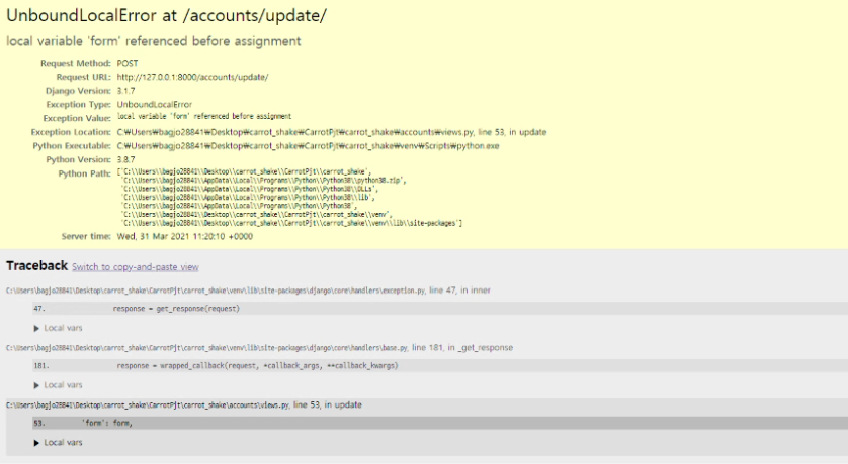
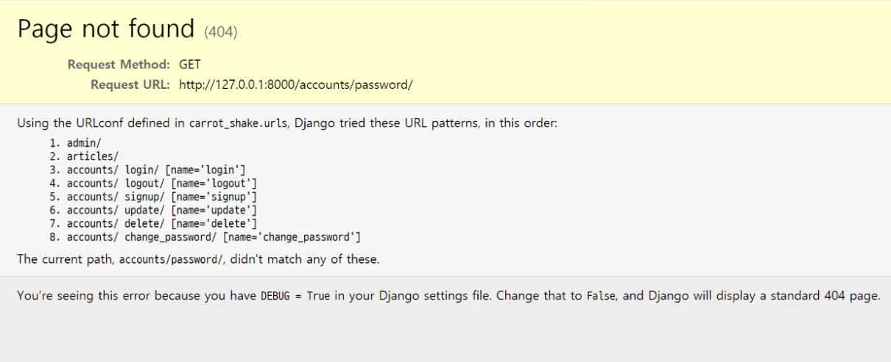

# 2일차  - 3월 31일

### 진행방향 설정

- accounts 앱 만들기
- 단단한 페이지 만들기 - 데코레이터 설정
- CRUD 템플릿 정리
- 모델링

### 오늘의 역할 배정

네비게이터: 김윤서 / 드라이버: 조은지 / 정리: 이은총

------

### 💙 모델링 구조

>  Apps
>
> - Articles
>   - Article
>   - Comment
> - Accounts
>   - User
>
> Article : Comment = 1 : N
>
> User : Article = 1 : N
>
> User : Comment = 1: N
>
> User : User = M : N


------

### 💙 accounts 앱 만들기

1. [settings.py](http://settings.py)

   앱 등록하기, AUTH_USER_MODEL = 'accounts.User' 등록

   +) 개발 편의를 위해 비밀번호 검증 도구 주석 처리 (추후 주석 해제할 것)

2. models.py에서 User 커스텀

   ```python
   from django.db import models
   from django.contrib.auth.models import AbstractUser
   
   # Create your models here.
   class User(AbstractUser):
       pass
   ```

3. admin 수정

4. 마이그레이션!

5. [views.py](http://views.py)

   login → logout → signup → update → delete → change_password

6. base.html 보강

   navbar 보강, footer 추가(회원 탈퇴 기능)

------

### ⚠️ 로그인 함수 → login.html

- 'AuthenticationForm' object has no attribute 'save'

🔍 원인 및 해결방법

```bash
- form.save()를 지운다.
- AuthenticationForm은 save 기능이 없기 때문에 이를 삭제하고 바로 로그인 하는 auth_login 사용하면 된다. 
```

### ⚠️ 회원정보 수정 함수(update) 1




🔍 원인 및 해결방법

```python
update 함수에서 if request.method == 'POST' 를 pass로 남겨두고 서버 오픈
ㅡㅡ if문을 다 완성하고 서버를 열었어야 한다.
```

### ⚠️ 회원정보 수정 함수(update) 2

- username을 수정했으나 변경되지 않음

🔍 원인 및 해결방법

```python
CustomUserChangeForm에 instance=request.user 를 넣지 않음.

그래서 create로 인식되어 새로운 username을 가진 계정이 생성됨.
```


### ✅ 회원탈퇴 함수(delete) - 해본 것

- 위에서 username이 수정되지 않고, 대신 생긴 새로운 계정을 url 접근을 통해서 접근하여 POST가 아닌 GET 방식으로 삭제해 보았다.
  - 그 대신 get_object_or_404로 user 정보를 받아야 하기 때문에 url로 pk를 입력 받아야 한다.

### ⚠️ 회원탈퇴 함수(delete)

- delete 버튼을 만들었으나 동작하지 않았다.

🔍 원인 및 해결방법

```python
delete 버튼을 넣은 form에 method를 GET으로 주었다.

methond를 POST로 바꾸어 해결했다.
```

### ⚠️ 비밀번호 변경 함수(change_password)



🔍 원인 및 해결방법

```python
입력한 url 주소와 urls.py에 설정한 주소가 서로 달랐다.

accounts/password로 urls.py를 바꾸어 해결했다.
```

### ❓ update_session_auth_hash(): `form.user` vs `request.user`

- update_session_auth_hash()의 두번째 파라미터에 `form.user` 대신 `request.user` 를 넣었지만 다른 점이 보이지 않았다.

  Q. **두 인자를 넣었을때의 차이점은?**

  ```python
  A. form.user는 중간에 유효성 검사를 거치는데 그냥 request.user를 넣을 경우
  form 의 유효성 검사를 하는 의미가 무색해진다...!
  instance를 통해 나온 유저인지 요청을 통해 나온 유저인지 의미론적 차이가 있으니 
  여기서는 form.user로 받자! 
  ```


### ❓ `form.user` vs `form.get_user`

- `AuthenticationForm` 의 `__init__`에는 self

  ```python
  Django.github
  
  class AuthenticationForm(forms.Form):
  
      def __init__(self, request=None, *args, **kwargs):
          
          self.request = request
          self.user_cache = None
          super().__init__(*args, **kwargs)
  
      def get_user(self):
          return self.user_cache
  
  class PasswordChangeForm(SetPasswordForm):
  	pass
  
  class SetPasswordForm(forms.Form):
      
      def __init__(self, user, *args, **kwargs):
          self.user = user
          super().__init__(*args, **kwargs)
  
      def save(self, commit=True):
          password = self.cleaned_data["new_password1"]
          self.user.set_password(password)
          if commit:
              self.user.save()
          return self.user
  ```

<hr> 

### 💜 Today I learned 

<hr>

- 또 다시 :car: Navigator 역할을 맡았다 ㅠ,,, 하지만 월말평가 전에 코드 흐름과 어려웠던 변수명들을 다 외워놔서 저번보다는 수월하게 진행할 수 있었다. 
- accounts 앱 제작 시 가장 중요한 점! :warning:
  - AUTH_USER_MODEL: 사용자 대체먼저 하기 :checkered_flag: (settings.py ㅡ models.pyㅡadmin)
  - 그 후에 makemigrations, migrate 하기 
- 이번 세션에 흥미로웠던 점: update 함수에 instance 설정을 해두지 않아서 create함수와 같은 역할을 하게 되었을 때, 그 계정을 삭제하기 위해 request.method == "POST" 조건을 걸지 않고 url로 계정을 삭제할 수 있게 만들었던 것!! 
  -  GET과 POST 기능 차이점을 배우기 전 단계의 코딩을 다시 활용해보니 기억이 새로웠고 뭔가 활용할 수 있는 단계에 온 것 같아서 뿌듯했다,,,,ㅎㅎㅎㅎ :happy:
- 여러 decorators를 적용해 주는것도 슬슬 익숙해져서 get, post, safe 등 어떠한 메서드를 붙여야 할지 금방 파악할 수 있었다! :smile:
- 4.5 (월): 알고리즘 수업 난이도에 따른 향후 계획 및 SQL 스터디 토의! 

<hr>

# 참고 

### ✅ `@require_safe` 와 `@require_GET` 의 차이점

- @require_GET은 GET만을 받아오는 반면,  @require_safe는 GET과 HEAD를 둘 다 받아온다.
- 일부 사이트에서는 HEAD만을 받아야 하는 경우가 있으므로 @require_safe 사용을 더 권장한다.

### 💙 CRUD에 사용자 인증(로그인) 여부에 따른 기능 사용 유무를 추가

- C/U/D 는 로그인한 사용자만이 사용할 수 있다.
- R은 로그인하지 않은 사용자도 게시판을 볼 수 있도록 하였다.

<hr> 

