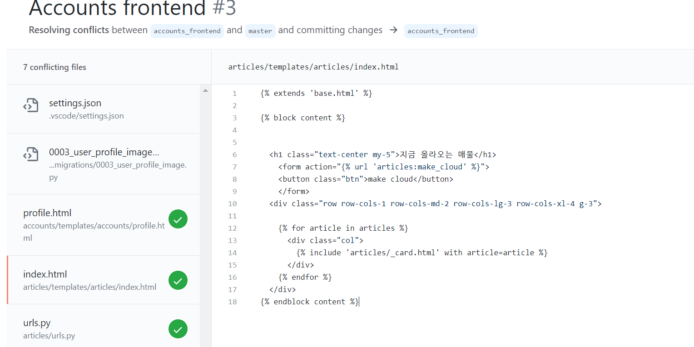

# 6**일차 - 4월 28일**

------

## :memo: TO DO 

1. 각자 진행상황 공유 및 피드백 (오늘 pr 이후로도 수정해서 5.3이 최종) (v) 
2. pr 충돌 합치기 ( 한 명 화면 보고 합치기) (v)
3. 4월 스터디 파일 정리 및 5월 계획서 제출 (V)

 

### :large_orange_diamond:  윤서 피드백 

- csv > 일일히 작성 ^^!  
  - image > media 폴더가 git에 안올라가는 문제! 
- footer ranking 
- social login 

### :large_orange_diamond:  은지 피드백 

- 언어 문제 논의 : 해시태그는 영어로?
- nav bar 수정 
- 색감 조정 :  x 

### :large_orange_diamond: 은총 피드백 

- image 크롭 

> 색깔 톤 맞추기

> 전체톤: 흰색 깔끔
>
> 포인트 색: \#a2cde5, rgb(162, 205, 229)

> 논의 
>
> - 향후 계획 : 5/3 종결 
>
>   1. 가계부 기능 : javascript 아예 다 배우고 template 없이 구현 
>
>   2. 하나씩 각자 기능 추가해서 주 1회 1시간 반 씩 토의시간만 가지기!
>
>   3. study (새로운 framework) 
>
>      ex) Nodejs / javascript 
>
> **최종 논의 사항 > 배너 이미지 (저작권)** 

> PR 과정 

### :baby_chick: 5.3 (월) TO DO 

- social login 
- 이미지 크롭 
- framework 

### 💜Today I learned 

- 너무 긴장됐던 pr 이었는데,,,,!! 생각보다 충돌이 적고 빠르게 합쳐져서 너무 뿌듯했다. 
- 그리고 세 명이 각자 프론트와 백앤드를 다 손봐서 합치니까 꽤 괜찮은 결과물이 나와서 더욱 뿌듯...! :happy:

- 어떻게 보면 오늘이 Django를 활용한 거의 마지막 프젝 날이었는데 

  몇 달간 배운거 복습하면서 다양한 오류를 부딪혀보는 재밌는 경험이었다 :thumbsup: 