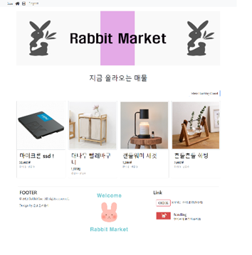
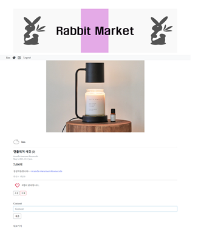

# 7**일차 - 5월 3일**

------

## :memo: TO DO 

1. social login
2. image 크롭 
3. 4월 스터디 결과 제출 
4. 5월 스터디 사항 정하기 **(5.12, 5.17, 5.26)**

  

### :large_orange_diamond:  5월 스터디 계획 

ㅡ> 네트워크 이론 

-  Google 엔지니어 

   https://www.youtube.com/watch?v=qiQR5rTSshw&t=331s

- 국내 IT 유튜브 

   https://www.youtube.com/playlist?list=PL0d8NnikouEWcF1jJueLdjRIC4HsUlULi

## 대략 완성 페이지!

#### index 

#### Detail

#### Create

#### Hashtag Cloud

#### popular hashtag 

#### Q&A

### :baby_chick:  Next TO DO 

- **login error** & Font = > 개별 확인해보기 

  csv 넣기 문제 => 내일 실습 최대한 활용해서 교수님이랑 끝내기..

- social login - 시간 없으면 그냥 merge 

- 5월 스터디 

### 💜Today I learned 

- Image 크롭하는거에 생각보다 시간이 오래 걸렸다. 

  - csv 파일을 만들었지만 이걸 vscode 에서 import 하는 방법과 img url을 넣는 방법을 잘 몰라서 잔뜩 헤맸다 ...ㅠㅠ 

- git 문제가 사상 최대로 발생 ..! 

  - 역시 git은 헤매면서 배운다지만 

    bash 창에서 수동으로 merge 하는 것이 수업 때 배웠지만 적용하기 어려웠고 

    git 자체에서 merge 하는게 세상 편하다는 것을 깨달았다 ...... 

- 또 ! image가 다를 경우 이를 merge하는거는 git 에서 안되기 때문에 수동 merge 방법을 택했다. 
